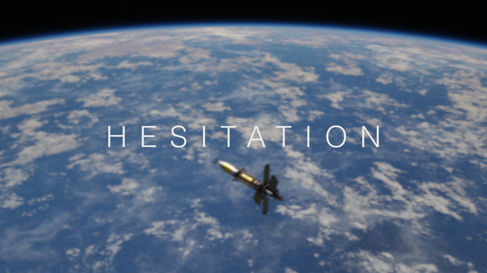

# hesitation
NEP Testbed

<!---->
<!--Physics + Software Team-->
<!--9get the guy with orbital mecahnics)-->
<!--look for people with ML experience -> rl -> cnn -->
<!--research group 1 --->
<!---->
<!--Hardware + FPGA Team-->
<!--reserach group 2 -->
<!--also collab with physics team for sending raidaiton ot the boards-->
<!---->
<!---->
<!--send some raidation number based on curent location -> intereacts with the fpga sensors  -->

